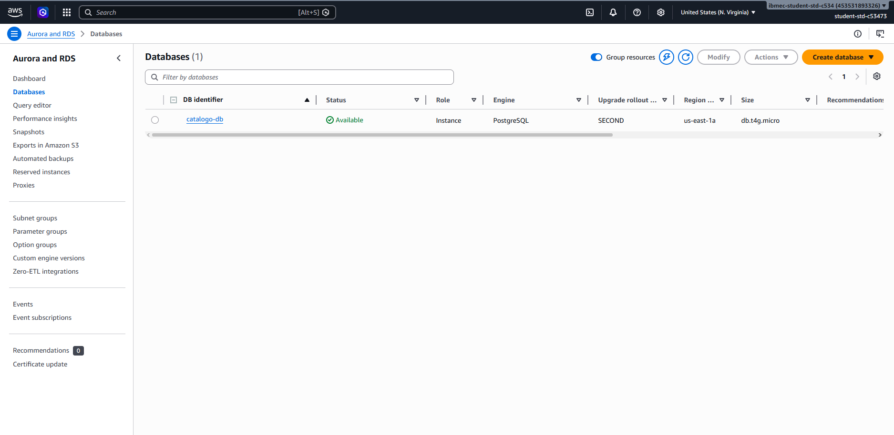
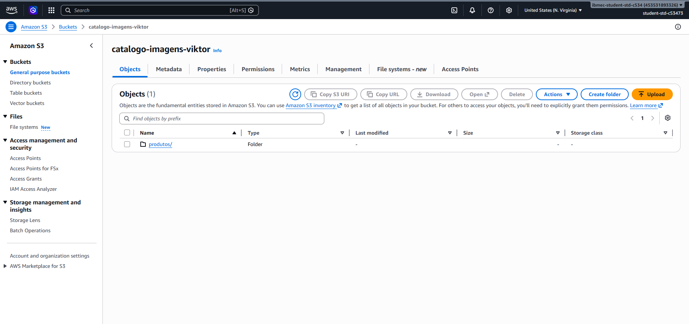
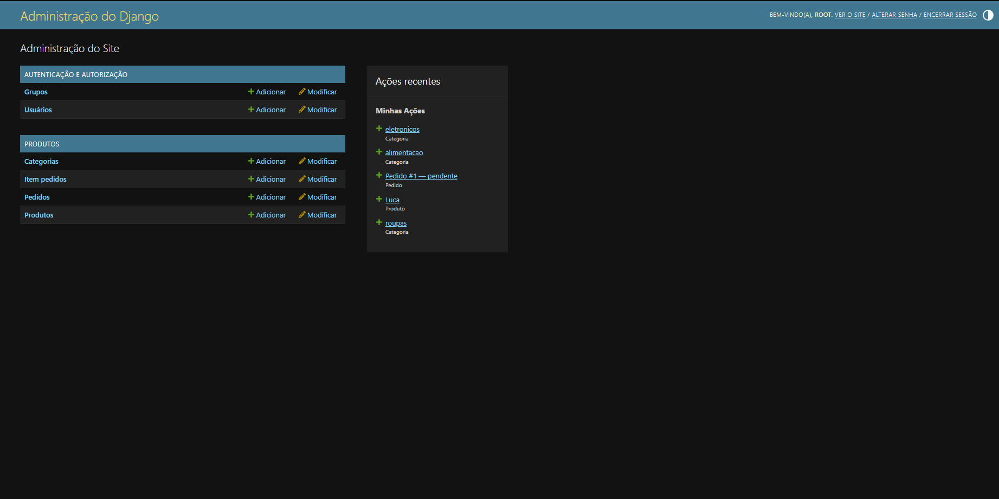
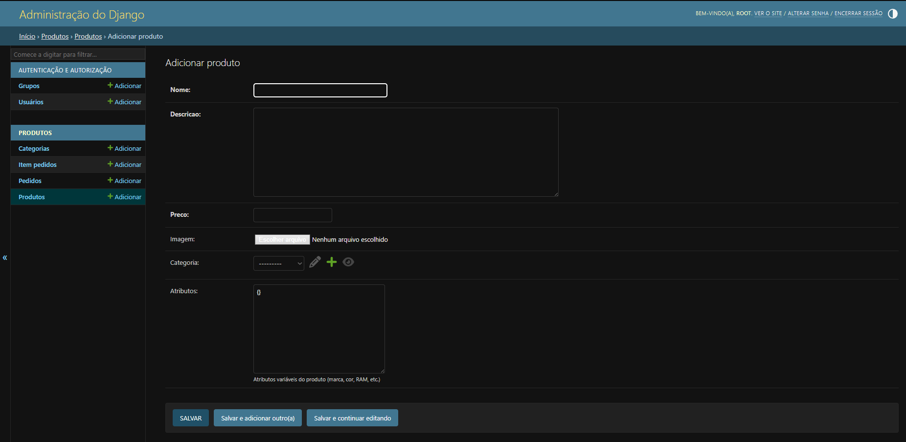
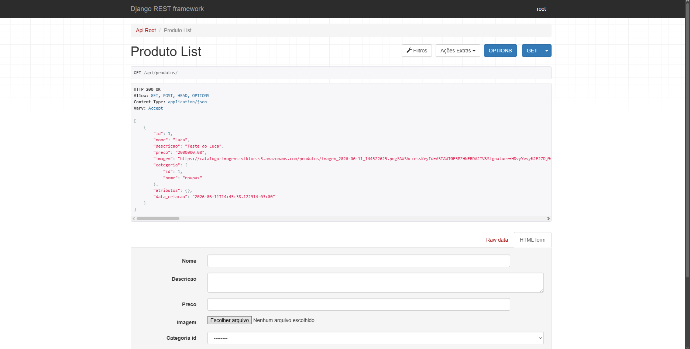

# AP1 e AP2 — Catálogo de Produtos

**Grupo:** Tiago Macedo, Viktor Mayer, Luca Confente

---

# AP1

**Deploy:** http://catalogo-produtos-categoria-v1-admin.eba-2anaedvb.us-east-1.elasticbeanstalk.com/api/

**Admin:** usuário `admin`, senha `123456`

Na AP1 construímos uma API REST em Django com duas entidades: `Categoria` e `Produto`, com relacionamento de chave estrangeira entre elas. A aplicação foi deployada no AWS Elastic Beanstalk usando Gunicorn como servidor e Nginx como proxy.

Para rodar localmente:

```bash
git clone <url-do-repositorio>
cd AP1
pip install -r requirements.txt
python manage.py migrate
python manage.py runserver
```

---

# AP2

**Deploy:** http://luca.us-east-1.elasticbeanstalk.com/api/

**Admin:** http://luca.us-east-1.elasticbeanstalk.com/admin/ — usuário `root`, senha `root1234`

## O que mudou em relação à AP1

Na AP1 o banco era SQLite (arquivo local na instância, que some a cada deploy) e as imagens ficavam no disco da própria instância. Na AP2 migramos para uma arquitetura mais próxima de produção:

- Banco de dados: **PostgreSQL no AWS RDS** (`catalogo-db`, `db.t4g.micro`, `us-east-1`)
- Imagens dos produtos: **AWS S3** (bucket `catalogo-imagens-viktor`)
- Credenciais: todas via variáveis de ambiente no EB, nada hardcoded
- Modelo de dados: adicionamos `Pedido` e `ItemPedido` para simular um carrinho de compras
- Campo `atributos` (JSONField/JSONB) em `Produto` para guardar metadados variáveis por tipo de produto (marca, cor, RAM, etc.)

## Evidências

**RDS ativo:**



**S3 com pasta `produtos/` criada após upload:**



**Admin logado como root:**





**API `/api/produtos/` retornando 200, campo `imagem` apontando pro S3:**



## Como rodar localmente

```bash
cd AP1
pip install -r requirements.txt
python manage.py migrate   # usa SQLite se DB_HOST não estiver definido
python manage.py runserver
```

Para conectar no RDS e S3 localmente, defina as variáveis antes de rodar:

```bash
export DB_HOST=catalogo-db.c61qo8ckyjtk.us-east-1.rds.amazonaws.com
export DB_NAME=catalogo_db
export DB_USER=postgres
export DB_PASSWORD=<senha>
export AWS_STORAGE_BUCKET_NAME=catalogo-imagens-viktor
```

## Deploy

```bash
cd AP1
python build_zip.py   # gera o app.zip
eb deploy             # ou sobe o zip manualmente pelo console do EB
```

Variáveis que precisam estar configuradas no ambiente do EB (Configuration → Software → Environment properties):

| Variável | Valor |
|---|---|
| `DB_HOST` | endpoint do RDS |
| `DB_NAME` | `catalogo_db` |
| `DB_USER` | `postgres` |
| `DB_PASSWORD` | senha do banco |
| `AWS_STORAGE_BUCKET_NAME` | `catalogo-imagens-viktor` |

## Endpoints

| Endpoint | O que faz |
|---|---|
| `GET /api/produtos/` | lista produtos |
| `POST /api/produtos/` | cria produto (aceita imagem) |
| `GET /api/produtos/?search=nome` | busca por texto |
| `GET /api/produtos/?categoria=eletronicos` | filtra por categoria |
| `GET /api/produtos/?marca=Dell` | filtra por atributo JSON |
| `GET /api/produtos/?cor=preto` | filtra por atributo JSON |
| `GET /api/produtos/?ram_gb=16` | filtra por atributo JSON |
| `GET /api/pedidos/` | lista pedidos |
| `POST /api/pedidos/` | cria pedido com itens |
| `POST /api/pedidos/{id}/adicionar-item/` | adiciona item ao pedido |

## Decisões técnicas

**Por que JSONField em vez de colunas separadas para os atributos?**
Produtos de categorias diferentes têm atributos completamente distintos — um eletrônico tem `ram_gb` e `cpu`, uma roupa tem `cor` e `tamanho`. Criar uma coluna para cada atributo possível geraria uma tabela com dezenas de colunas opcionais. Com `JSONField` cada produto guarda só o que faz sentido pra ele, e o PostgreSQL indexa o campo como JSONB, então as consultas `?marca=Dell` ou `?cor=preto` ainda são eficientes.

**Por que SQLite local e PostgreSQL na nuvem?**
O `settings.py` checa se `DB_HOST` está definido. Se não estiver (ambiente local), usa SQLite. Isso evita que todo o grupo precise instalar e configurar PostgreSQL só pra rodar o projeto localmente.

## Dificuldades que tivemos

**O deploy ficava falhando no `01_migrate` sem mensagem de erro clara.**
O `eb-engine.log` só dizia "Command failed". O erro real estava no `cfn-init-cmd.log`, que a gente não sabia que existia. O problema era que os `container_commands` do EB não ativam a virtualenv automaticamente — o `python` que ele encontrava era o do sistema, sem Django instalado. Resolvemos prefixando cada comando com `source /var/app/venv/*/bin/activate &&`.

**Esquecemos de criar o banco no RDS.**
Quando criamos a instância RDS, o PostgreSQL cria só o banco padrão (`postgres`). O banco `catalogo_db` não existia, então o `migrate` quebrava com `FATAL: database "catalogo_db" does not exist`. Precisamos conectar via CloudShell e rodar:
```bash
psql -h catalogo-db.c61qo8ckyjtk.us-east-1.rds.amazonaws.com -U postgres -d postgres -c "CREATE DATABASE catalogo_db;"
```

**As imagens subiam pro disco local em vez do S3.**
Mesmo com `django-storages` instalado e `DEFAULT_FILE_STORAGE` configurado, os uploads iam pro disco. Depois de investigar descobrimos que no Django 6.0 essa configuração foi removida e é simplesmente ignorada. A forma correta agora é usar o dicionário `STORAGES = {'default': {'BACKEND': '...'}}`.

**As URLs das imagens no S3 expiram.**
As URLs geradas pelo django-storages são pré-assinadas (têm `?AWSAccessKeyId=...&Signature=...`) e expiram após um tempo. Não conseguimos resolver isso dentro do prazo — a solução seria configurar o bucket com leitura pública ou colocar um CloudFront na frente.
